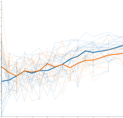
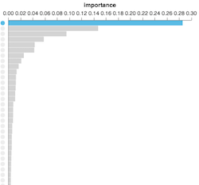
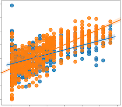

# longitudinal-notebooks

This repository contains example code, an analysis notebook, and example results for the q2-longitudinal plugin.

This repository only contains selected examples for the q2-longitudinal plugin. For complete tutorials and more information, see https://github.com/qiime2/q2-longitudinal

## Gallery

[Volatility Plots](https://view.qiime2.org/visualization/?type=html&src=https%3A%2F%2Fraw.githubusercontent.com%2Fcaporaso-lab%2Flongitudinal-notebooks%2Fmaster%2Fresults%2Fvolatility.qzv)

[Feature Volatility](https://view.qiime2.org/visualization/?type=html&src=https%3A%2F%2Fraw.githubusercontent.com%2Fcaporaso-lab%2Flongitudinal-notebooks%2Fmaster%2Fresults%2Ffeat-volatility-genus%2Fvolatility_plot.qzv)

[Linear Mixed Effects](https://view.qiime2.org/visualization/?type=html&src=https%3A%2F%2Fraw.githubusercontent.com%2Fcaporaso-lab%2Flongitudinal-notebooks%2Fmaster%2Fresults%2Fshannon-linear-mixed-effects.qzv)
